---
# ORACLE Cloud-Native DevOps workshop #
-----
## Developer Cloud Service を用いた Eclipse 統合開発環境 (Oracle Enterprise Pack for Eclipse) の利用

### 説明
Developer Cloud Service は、Oracle Enterprise Pack for Eclipse や、Oracle JDeveloper, NetBeans のような統合開発環境から利用できる。Eclipse と Oracle Enterprise Pack for Eclipse (OEPE) は、Developer Cloud Service との統合機能を備えており、Developer Cloud Service で管理している開発タスクをIDE の中で閲覧する事がができる。

Developer Cloud Service とEclipse との統合により以下の機能を実現する。

- メンバーとなっているDeveloper Cloud Service プロジェクトの専用ビューの表示
- Mylyn とDeveloper Cloud Service の問題管理システムの統合
- ソース管理システムとDeveloper Cloud Service のGit リポジトリの統合

Eclipse ダウンロード・サイト
- [http://www.eclipse.org/](http://www.eclipse.org/)

OEPE ダウンロード・サイト
 - [http://www.oracle.com/technetwork/developer-tools/eclipse/downloads/index.html](http://www.oracle.com/technetwork/developer-tools/eclipse/downloads/index.html).

Eclipse を使用する場合は、Eclipse マーケット・プレイスからOracle Cloud Tools plugin をダウンロードしてインストールをする。OEPE の場合は、デフォルトでプラグインがインストールされている。

### チュートリアルについて
このチュートリアルは、以下を実施する:

+ Eclipse 統合開発環境のセットアップ (Oracle Enterprise Plugin for Eclipse)

### 前提

- 以下のチュートリアルを実施済みである事
  - [Spring Boot アプリケーション用のDeveloper Cloude Service プロジェクトの作成](../springboot-sample/create.devcs.project.md)
  - [Developer Cloud Service と Application Container Cloud Service を用いた継続的ビルド・インテグレーションの作成](../springboot-sample/devcs.accs.ci.md)
- Eclipse IDE with Oracle Cloud Tools plugin 導入済みのEclipse または、Oracle Enterprise Plugin for Eclipse をインストール済みである事

### 手順

#### Cloud Tools Plugin の設定

OEPE を開き、Welcomeページを閉じる。Window メニューから、***Oracle Cloud*** ビューを開くために、***Show View*** をクリックし、続いて ***Other*** をクリックする。

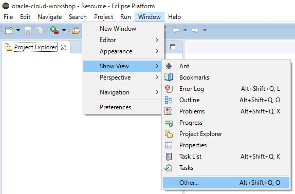


一覧から ***Oracle Cloud***　を展開し、その中の ***Oracle Cloud*** を選択する。

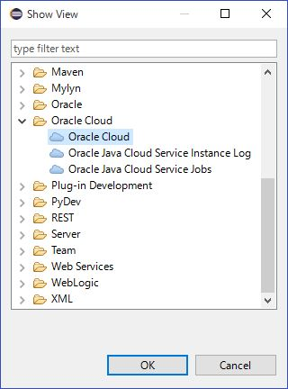


Developr Cloud Service へ初回接続の場合は、**Connect** をクリックする。


Oracle Cloud Connection ダイアログが表示されるので、以下の項目を入力する。

- **Identity Domain**: アイデンティティ・ドメイン名
- **Username**: ログイン・ユーザ名
- **Password**: ログイン・パスワード
- **Connection Name**: Oracle Cloud への接続の識別名、デフォルトではアイデンティティ・ドメイン名が設定される

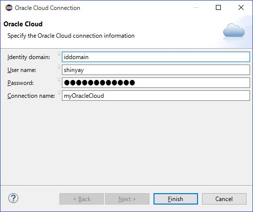


認証が通った後、Developer Cloud Service へログインすると、割り当たれているプロジェクトが表示される。Oracle Cloud ビューでツリーを展開していく。
[Connection name] -> Developer -> [Developer Cloud Serviceで作成済みのプロジェクト名] -> Code と展開すると、Developer Cloud Service でホストしている Git リポジトリが表示される。


この Git リポジトリをOEPE内にクローンするために、**ダブル・クリック** か、**右クリックしてActivate** を実施する。

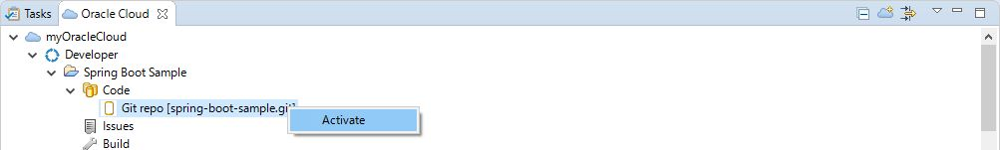


Git リポジトリのクローンが行われる。


クローンが成功すると、ワークスペースで利用できるようになる。

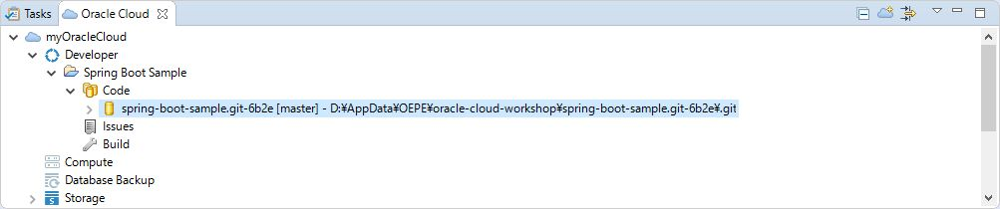


Maven プロジェクトをインポートするために、**Project Exporer** で右クリックし、ポップアップ・メニューから **Import -> Import...** を選択する。

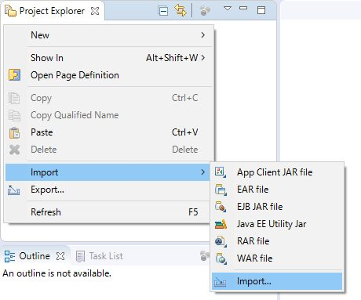


一覧から **Existing Maven Projects** を選択し、**Next** をクリックする。

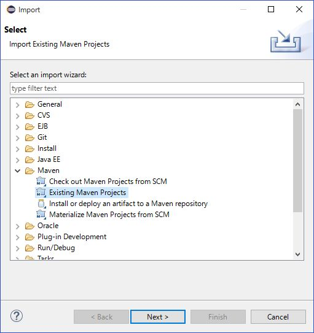


ワークスペース・フォルダにクローンされているリポジトリの位置を **Browse...** から参照し、**springboot-sample** サブフォルダを選択し **OK** をクリックする。

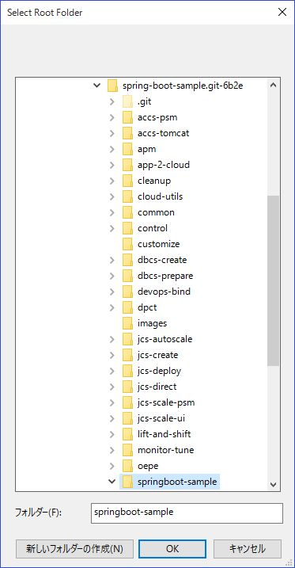


追加したプロジェクトにチェックを付け、**Finish** をクリックする。

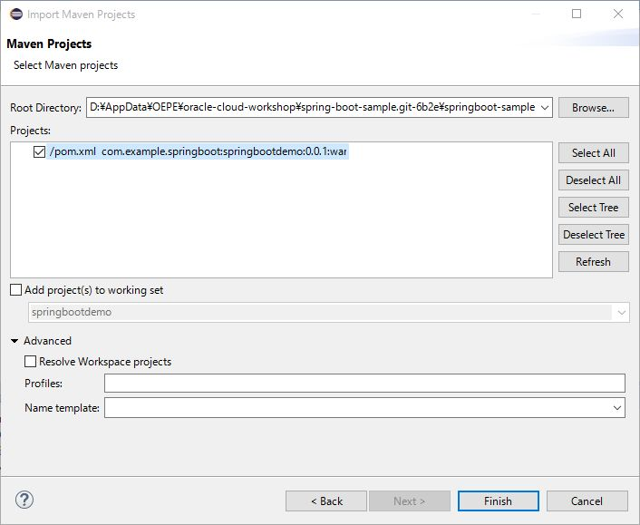


OEPE は妥当性チェックとプロジェクトのビルドを開始する。ビルドが終了すると、Project Explorer にプロジェクトをインポートでき ている。

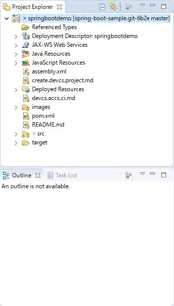


#### 継続的インテグレーションを利用したコードの変更とテスト

Developer Cloud Service 上のプロジェクトは、開発者が Git リポジトリにコードを格納した時にアプリケーションをビルドする **ビルド・ジョブ** と、Application Container Cloud Service への **デプロイメント** 機能を持っている。
アプリケーションを少し修正し、その一連のプロセスを確認する。

First check the default page of the application. Open the tree view myOracleCloud -> Applications -> springboot-demo. Right click on springboot-demo and select Open In Browser menu item.


New browser is opened and you should see the application's home page.


OEPE の **Project Explorer** で ***springbootdemo*** プロジェクトを開き、 **Deployed Resources** を展開して **webapp -> WEB-INF -> views -> welcome.jsp** を開く。

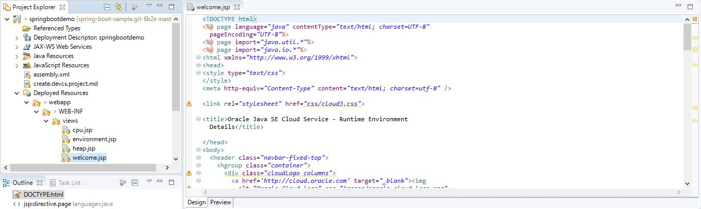


以下の箇所を修正する:

```html
  	<br>SpringBoot application demo. Current server time: <%= new java.util.Date() %> <br>
```

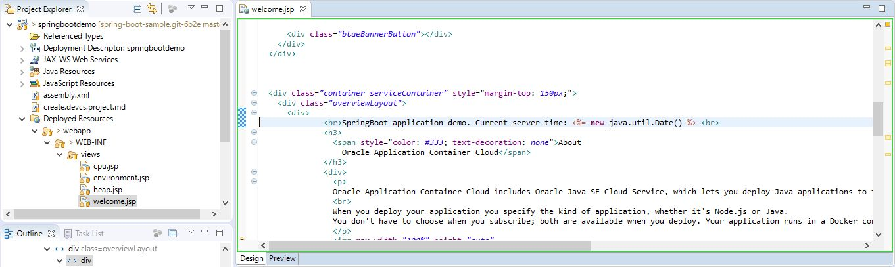

修正例:

```html
	<br>SpringBoot application demo. <font color="red">MODIFIED IN OEPE.</font> Current server time: <%= new java.util.Date() %> <br>  	
```

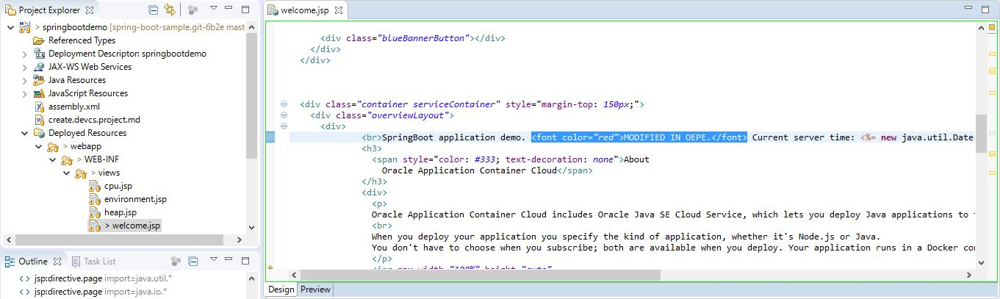


変更を保存する。変更内容をコミットし、Git リポジトリにプッシュするためにプロジェクトを **右クリックして Team -> Commit...** を選択する。

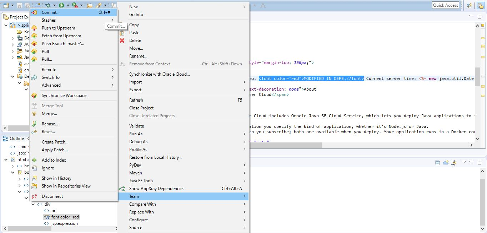


**Git Staging** ビューが表示される。まず、`welcome.jsp` を***Unstaged Changes*** から ***Staged Changes*** にドラッグ・アンド・ドロップで移動する。そして、**Commit Message** を入力する。例："OEPE でホームページを修正"
オプションで Author 及び Committer に名前とメールアドレスを入力する。
最後に **Commit and Push...** をクリックする。

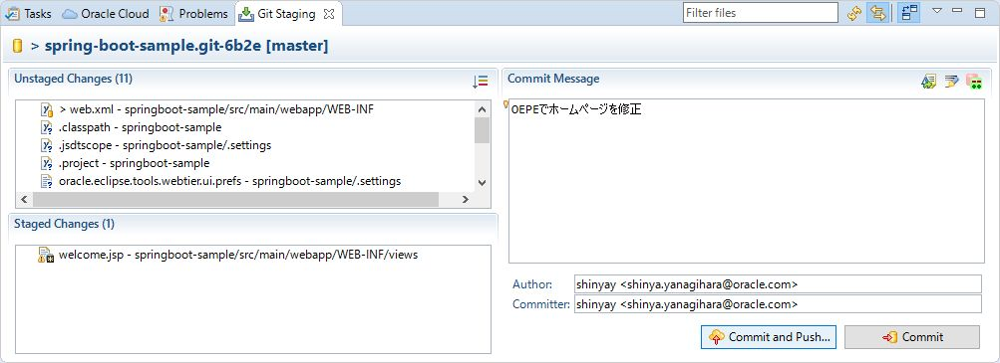


**Push Results** ダイアログが表示される。デフォルト・ブランチのまま変更せずに、このまま **OK** をクリックする。

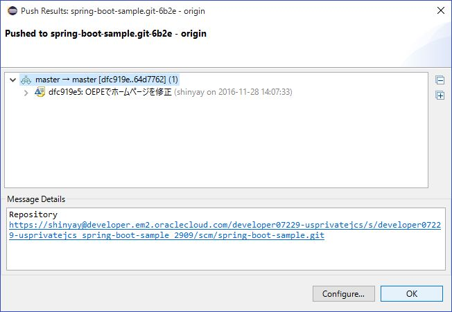


ブラウザで Develop Cloud Service プロジェクトのビルドページを表示する。Git リポジトリの変更に伴うビルドが確認できる。(以下の例では、*Spring_Boot_Sample_App_Build*)

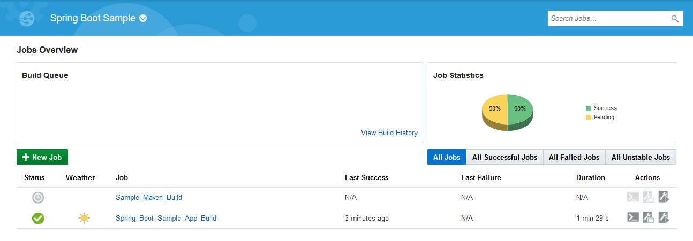


ビルド・ジョブが終了したらデプロイタブに変更する。すると、新しく行われたデプロイメントが確認できる。

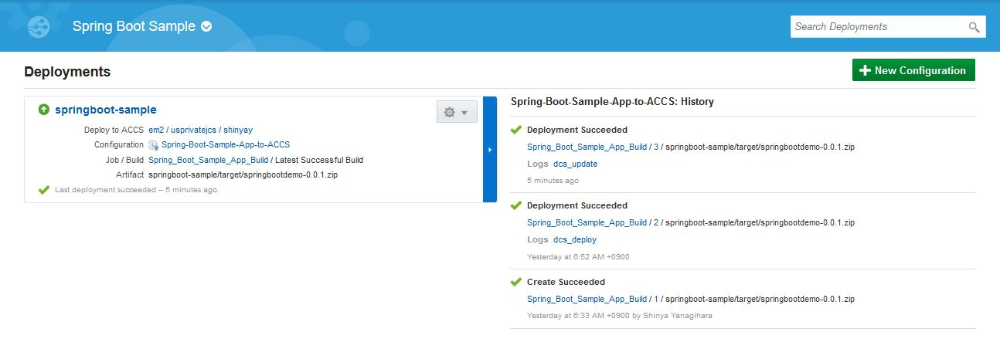


ブラウザでSpring Boot サンプル・アプリケーションを確認すると、変更内容が反映されている事が確認できる。

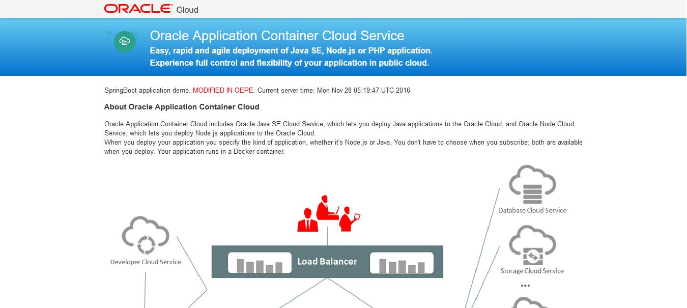
